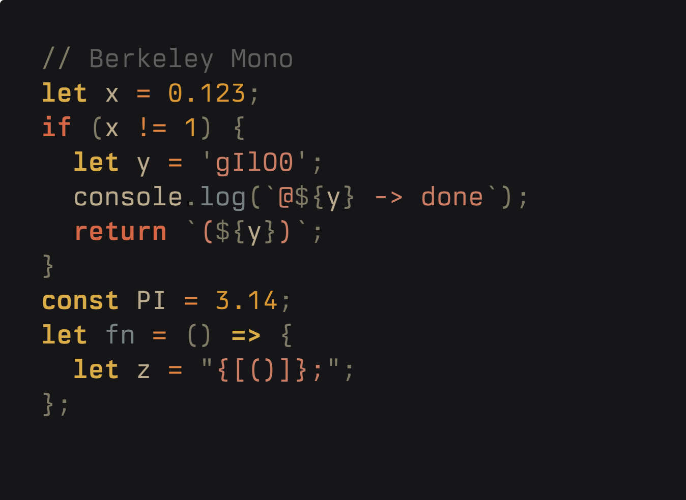

# IoskeleyMono

The goal of this project is to configure the [Iosevka](https://github.com/be5invis/Iosevka) typeface to mimic the look and feel of **Berkeley Mono** as closely as possible.

It uses Iosevka's extensive build options to select character variants that replicate the distinct aesthetic of Berkeley Mono, creating a free, open-source alternative for fans of that particular style.

The name is a simple mashup: **Iosevka** + **Berkeley** = **Ioskeley**.

This repository uses GitHub Actions to automatically build the font files whenever the configuration is updated.

---

## Installation

The easiest way to get the font is to download it directly from the **Releases** page.

1. [Click here to go to the Releases Page](https://github.com/ahatem/IoskeleyMono/releases)
2. Find the latest release and download the `IoskeleyMono-Build.zip` file.
3. Unzip the file and install the fonts on your system.

---

## Preview

### Ioskeley Mono

### Berkeley Mono

### Configuration Choices

To achieve the Berkeley Mono aesthetic, the following key variants were selected from Iosevka's available glyphs:

- **Numbers:** Dotted zero (`0`) and open-contour `6` and `9`.
- **Key Characters:** A classic double-storey `a` and a modern single-storey `g`.
- **Punctuation:** Sharp, square dots for a crisp, technical feel.
- **Underscore:** Set to `high` for better visibility.
- **Ligatures:** Standard programming ligatures are enabled.

For a complete list of all choices made to match Berkeley Mono, see the [`private-build-plans.toml`](./private-build-plans.toml) file.

---

### License & Credits

**Credits**: Ioskeley Mono is a custom configuration of the Iosevka typeface. All credit for the original design and build system goes to Belleve Invis and the Iosevka contributors.

Because this is a derivative of Iosevka, it is licensed under the same **SIL Open Font License 1.1**. See the `LICENSE` file for full details.
